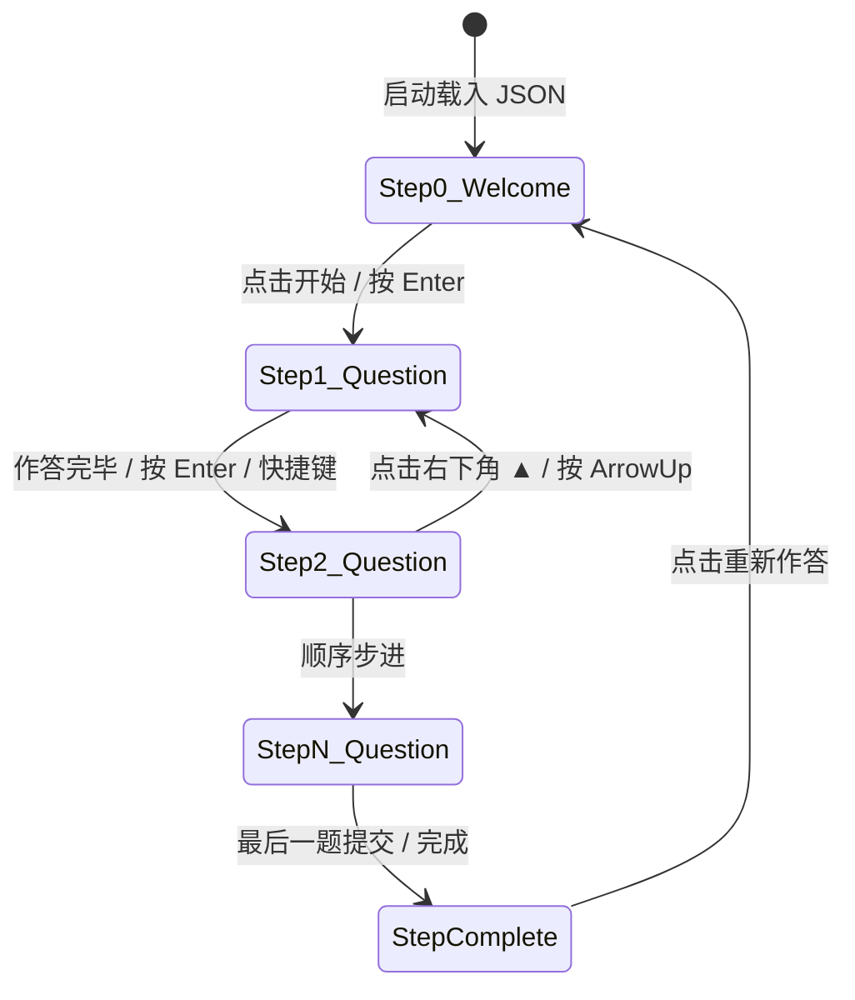

# TypeSense 问卷系统前端开发与架构指南 (Development Guide)

本文档为 **TypeSense 问卷系统**（基于 Node.js / Vite + TypeScript + Vanilla CSS 构建）的详细开发与架构规范指南。旨在为团队开发者提供清晰的目录边界认知、题型扩展准则、JSON 契约格式以及 Formbricks 沉浸式交互状态机的实现逻辑。

---

## 1. 架构理念与核心准则 (Core Principles)

1. **绝对解耦与纯数据驱动 (Zero Hardcoded Survey Content)**
   - 前端所有 TypeScript、HTML 与 CSS 文件中**禁止硬编码任何问卷题目、说明、选项或打分文案**。
   - 所有页面内容（欢迎语、题目、选项、提示、量表维度、完成文案）必须 100% 通过外部 JSON 契约异步载入并动态装配。
2. **Formbricks 风格一题一页沉浸式视界 (Step-by-Step Focus)**
   - 摒弃冗长的滚屏式长表单，采用居中高聚焦度的“一题一页”卡片体验。
   - 包含：`Step 0 欢迎屏` -> `Step 1~N 独立题目卡片` -> `Step N+1 完成感谢屏`。
   - 支持流畅的向上滑入动效、回车键快捷推进 (`Enter ↵`)、单选题快捷字母选择与快速自动推进。
3. **架构规范遵守 ([code_architecture.md](file:///.agents/rules/code_architecture.md))**
   - **目录边界**：每个业务核心目录均配有专门的 `INDEX.md`，严格限定该模块职责与依赖方向。
   - **命名规范**：前端源码一律采用 `kebab-case`，严禁使用 `utils.ts`、`common.ts` 等空洞命名。
   - **单一职责**：渲染引擎负责流程编排与状态分发，四大题型组件各自独立封装，互不污染。

---

## 2. 项目目录结构与模块说明 (Directory Structure)

```
TypeSense/
├── package.json                         # 项目脚本与依赖 (Vite, TypeScript)
├── tsconfig.json                        # TS 严格类型配置
├── vite.config.ts                       # Vite 构建配置
├── index.html                           # 用户答卷页 (Formbricks 逐题作答)
├── admin.html                           # 管理端页面 (自组织无限幕布)
├── DEVELOPMENT.md                       # 开发指南
├── public/
│   └── data/
│       └── questionnaire-sample-survey.json  # 简洁标准的动态问卷 JSON 样例
└── src/
    ├── main.ts                          # 用户端入口 (挂载 Formbricks 逐题问卷)
    ├── admin.ts                         # 管理端入口 (挂载自组织无限幕布)
    ├── schema/
    │   └── questionnaire-schema-types.ts# 极简问卷模型与选项标准化契约
    ├── services/
    │   └── questionnaire-loader-service.ts  # 问卷 JSON 加载与合法性校验
    ├── questions/                       # 核心题目插件目录 (每类题型独立文件夹)
    │   ├── types.ts                     # 插件统一上下文与接口定义
    │   ├── registry.ts                  # Vite import.meta.glob 自动动态注册中心
    │   ├── single-choice/index.ts       # 单选题目插件
    │   ├── multiple-choice/index.ts     # 多选题目插件
    │   ├── text-input/index.ts          # 文本填空题目插件
    │   └── likert-scale/index.ts        # 李克特量表题目插件
    ├── renderer/
    │   └── questionnaire-form-renderer.ts # 问卷分步渲染器 (通过 registry 动态调度各题型)
    ├── canvas/
    │   ├── services/
    │   │   ├── questionnaire-graph-transformer.ts # 问卷无坐标抽象图转换
    │   │   └── canvas-layout-engine.ts            # 基于 elkjs 的分层拓扑自组织计算
    │   ├── components/
    │   │   ├── canvas-node-card-element.ts        # 幕布卡片节点 (内嵌动态题目插件)
    │   │   └── canvas-connection-line-element.ts  # 节点间 SVG 贝塞尔流向连线
    │   └── viewport/
    │       └── infinite-canvas-viewport.ts        # @panzoom/panzoom 视口平移缩放漫游
    └── styles/
        ├── design-system-tokens.css     # 设计令牌 (配色、字体、圆角)
        ├── questionnaire-presentation.css # Formbricks 用户页样式
        └── infinite-canvas.css          # 管理端无限幕布样式
```

---

## 3. 题目组件插件化架构 (Pluggable Question Components)

系统采用高度可扩展的**插件化注册机制**（位于 `src/questions/`）：
- **自包含文件夹**：不同题型拥有自己的独立文件夹（如 `src/questions/single-choice/index.ts`）。
- **统一插件接口 (`types.ts`)**：
  ```typescript
  export interface QuestionPlugin {
    type: string;
    render(context: QuestionRenderContext): HTMLElement;
  }
  ```
- **自动发现与注册 (`registry.ts`)**：
  利用 Vite 的 `import.meta.glob('./*/index.ts', { eager: true })` 自动扫描并注册文件夹下的所有插件。新增任意题型只需新建文件夹并导出插件对象，核心渲染器零修改即可自动支持！

---

## 4. 问卷存放目录与 JSON 契约格式 (Surveys Directory & Schema)

### 4.1 目录划分 (`public/data/surveys/`)
所有就绪的静态问卷统一存放在 `public/data/surveys/` 子目录下：
- `public/data/surveys/survey_tech_2026.json`：具体问卷数据；
- `public/data/surveys/manifest.json`：静态问卷索引清单（包含 ID、标题、题目数等元数据）。

### 4.2 非线性有向拓扑图流向模型 (DAG Flow Schema)
问卷彻底摒弃“所有题串成一串”的线性死板模式，采用 **有向图 (DAG)** 组织：
- **题目节点 (`questions`)**：通过 `next?: string` 指向下一跳题目或逻辑节点；
- **逻辑原语节点 (`logicNodes`)**：
  - `branch`：基于条件分流至多个相互独立的候选题群（如管理层题群、一线工程师题群、单体题群、微服务题群）；
  - `merge`：将分散的多条平行分支汇流至统一节点；
  - `condition`：显隐守卫（满足则放行/跳过，不满足则追问探究）；
  - `random`：A/B 随机路径加权分流；
  - `loop`：针对多子系统/团队的循环复核；
  - `terminate`：甄别下线与完成收束。
- **自组织画布实时呈现**：管理端幕布 (`admin.html`) 依据该 DAG 数据，由 `elkjs` 毫秒级自组织计算出真实的分叉、汇流与跳跃拓扑。

标准问卷 JSON 数据示范：

```json
{
  "id": "survey_tech_2026",
  "title": "2026 开发者效能调查",
  "description": "问卷说明文案",
  "questions": [
    {
      "id": "q1",
      "type": "single_choice",
      "title": "您的研发角色？",
      "required": true,
      "options": ["前端开发", "后端开发", "全栈开发"]
    },
    {
      "id": "q2",
      "type": "multiple_choice",
      "title": "经常使用的工具？",
      "required": true,
      "options": ["TypeScript", "Docker", "AI辅助"]
    },
    {
      "id": "q3",
      "type": "likert_scale",
      "title": "对当前效能工具的认同度：",
      "required": true,
      "options": ["强烈不赞同", "不太赞同", "中立", "基本赞同", "非常赞同"]
    },
    {
      "id": "q4",
      "type": "text_input",
      "title": "您的优化建议？",
      "required": false,
      "placeholder": "请输入改进建议..."
    }
  ]
}
```

---

## 5. 渲染引擎状态流转 (State Machine Workflow)



### 全局键盘快捷键矩阵：
| 快捷键 | 生效场景 | 动作描述 |
| :--- | :--- | :--- |
| `Enter` ↵ | 欢迎屏 / 题目屏 | 推进至下一题（必填项未答时触发轻微抖动提醒） |
| `ArrowDown` ↓ | 题目屏 | 下一步 |
| `ArrowUp` ↑ | 题目屏 | 返回上一步 |
| `A`, `B`, `C`, `D`... | 单选 / 多选题 | 快速选择对应字母项 |
| `1`, `2`, `3`, `4`, `5` | 李克特量表 | 快速选中对应分值 |
| `Ctrl + Enter` | 多行文本输入框 | 提交并跳转至下一题 |

---

## 6. 开发、调试与构建指令 (Commands)

### 6.1 安装依赖
```bash
npm install
```

### 6.2 启动本地开发服务与三页面访问 (Multi-Page Architecture)
```bash
npm run dev
```
启动后可在浏览器分别访问三个具有独立物理职责的页面：
1. **后台发布与管理控制台 (`index.html` / 根路径 `/`)**：
   - 访问路径：`http://localhost:5173/`
   - 特性：问卷总览面板、查看所有就绪问卷、新建/导入并一键发布问卷、获取并一键复制专属唯一访问链接、导出标准 JSON。
2. **受访者专属答题页 (`survey.html`)**：
   - 访问路径：`http://localhost:5173/survey.html?id=<uniqueId>`
   - 特性：纯净沉浸式一题一页 Formbricks 作答体验；未带参数或无效 ID 时明确提示“未指定问卷或链接失效”，杜绝无序加载。
3. **流程拓扑无限幕布 (`admin.html`)**：
   - 访问路径：`http://localhost:5173/admin.html?id=<uniqueId>`
   - 特性：基于 `elkjs` 毫秒级自组织推导分层拓扑图，支持 `@panzoom/panzoom` 漫游缩放、全景居中与流向切换。

### 6.3 生产构建与类型检查
```bash
npm run build
```
编译将先调用 `tsc` 进行严格静态类型排查，随后调用 `vite build` 自动进行多页面打包至 `dist/` 目录（包含 `index.html`、`survey.html`、`admin.html` 三个独立 HTML）。

---

## 7. 自组织无限幕布架构 (Self-Organizing Canvas Architecture)

1. **去坐标化设计**：
   - 问卷 JSON 文件（`questionnaire-sample-survey.json`）绝不包含任何硬编码坐标。
   - `QuestionnaireGraphTransformer` 将问卷抽象为带有长宽估算的节点序列与逻辑流向边。
2. **算法排版引擎 (`elkjs`)**：
   - `CanvasLayoutEngine` 调用 ELK 的 `elk.layered` 分层拓扑算法，毫秒级推导 `x, y, width, height` 与贝塞尔连接线控制点。
3. **视口漫游与交互 (`@panzoom/panzoom`)**：
   - `InfiniteCanvasViewport` 实现视口层平移缩放，排除卡片内部点击（支持在卡片内直接与题目互动），配备全景自适应居中与水平/垂直流向切换功能。

---

## 8. 流程控制逻辑结构群与纯数值体系 (Logic Structure Group & Numerical System)

### 8.1 0-indexed 标准化数值体系
问卷作答结果彻底杜绝字符串匹配：
- **单选 (`single_choice`)**：返回选项下标数字 `0, 1, 2...`；
- **多选 (`multiple_choice`)**：返回选项下标数字数组 `[0, 2]...`；
- **李克特量表 (`likert_scale`)**：返回档位下标数字 `0, 1, 2, 3, 4`；
- **填空题 (`text_input`)**：返回自由文本，**明确不参与任何流程逻辑控制判断**。

### 8.2 开放式算法注入 (Algorithm Injection)
除了常规基础运算符（`==`, `!=`, `>`, `<`, `>=`, `<=`, `contains`, `in`），支持通过 `registerAlgorithm` 注入任意自定义业务算法（如量表加权算分、心理学维度计算、动态路由决策器）：
```typescript
import { registerAlgorithm } from './logic';

// 注入自定义打分/分流算法
registerAlgorithm('custom_composite_score', (context) => {
  const q1 = typeof context.answers['q1'] === 'number' ? context.answers['q1'] : 0;
  const q3 = typeof context.answers['q3'] === 'number' ? context.answers['q3'] : 0;
  return q1 * 10 + q3 >= 15;
});
```

### 8.3 8 大核心逻辑原语插件 (`src/logic/`)
每个逻辑原语在 `src/logic/` 下独立子目录自包含，由 Vite 自动扫描注册：
1. **`condition` (条件判定/显隐守卫)**：判定前置依赖，决定是否放行或跳过题目；
2. **`branch` (多路条件分支)**：按规则优先级匹配第一命中路径，支持数值路由与算法路由；
3. **`merge` (分支汇流节点)**：作为多条分流路径的交汇终点，统一步进游标；
4. **`loop` (循环流转)**：支持 `repeat` 固定次数循环与 `while` 条件循环，带最大安全防死循环保护；
5. **`foreach` (多选数组遍历)**：针对多选题选中的 `[0, 2]` 下标数组逐项遍历并驱动子题；
6. **`jump` (游标跳转)**：直接无条件跳转至指定节点；
7. **`random` (随机化控制)**：支持 A/B 测试概率加权随机分流 (`random_branch`) 与题目顺序洗牌 (`random_order`)；
8. **`terminate` (流程终止/熔断)**：支持提前退出并标注细分状态（`completed`, `disqualified`, `quota_full`）。

### 8.4 状态机调度引擎 (`QuestionnaireFlowEngine`)
`QuestionnaireFlowEngine` 负责协调题目节点与逻辑原语节点的穿梭执行，答卷后自动级联穿透所有逻辑节点，直至停在下一可交互题目或终止态。

---

## 9. 务实架构与反形式主义准则
- 遵循 [code_architecture.md](file:///.agents/rules/code_architecture.md) 与 [AGENTS.md](file:///c:/Users/meru6/Desktop/TypeSense/AGENTS.md)。
- 严禁在小目录滥建空洞的 `INDEX.md`。
- 严禁未经用户许可启动自动化浏览器测试。代码以功能交付和静态类型安全为第一准则。
